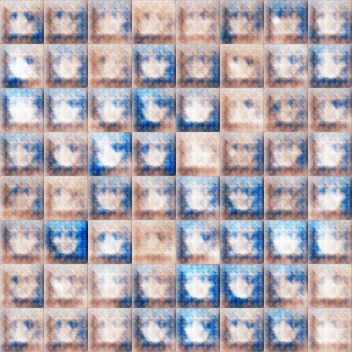
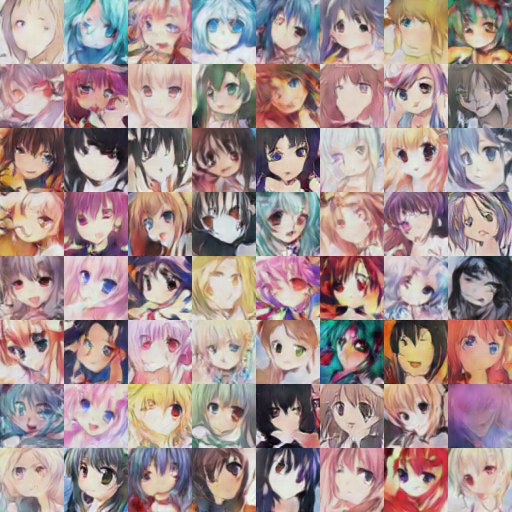
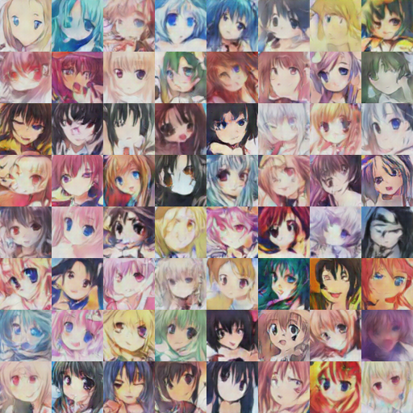
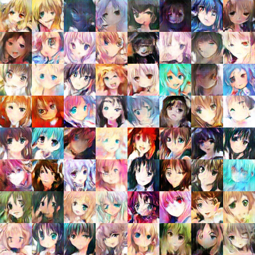
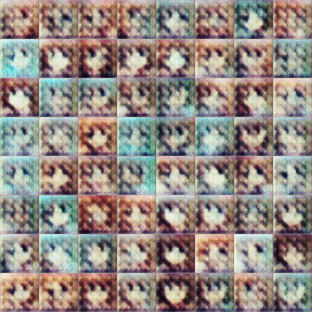
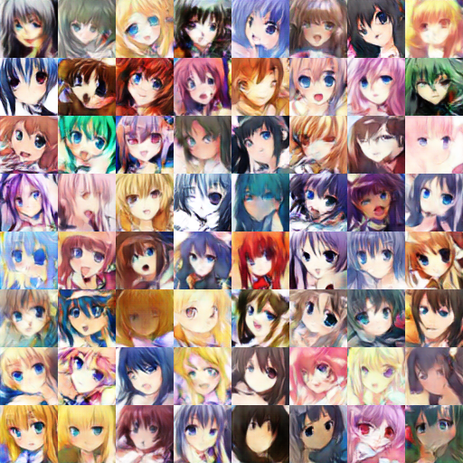
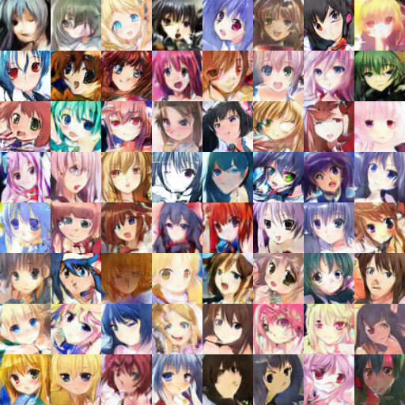

# Anime GAN
> A simple PyTorch Implementation of  Generative Adversarial Networks, focusing on anime face drawing.
This project use 3 type of GAN to experiment including DCGAN, WGAN_GP and DRAGAN.

## Dataset
Dataset I use is from this paper [Towards the Automatic Anime Characters Creation with Generative Adversarial Networks](https://arxiv.org/abs/1708.05509)

This dataset is collected by the authors which content 42000 face image of anime character.

You can download the training data from: https://drive.google.com/open?id=1bXXeEzARYWsvUwbW3SA0meulCR3nIhDb

## Generative Adversarial Networks (GANs)
*Name* | *Paper Link* | *Value Function*
:---: | :---: | :--- |
**DCGAN** | [Arxiv](https://arxiv.org/abs/1511.06434) | 
**WGAN_GP**| [Arxiv](https://arxiv.org/abs/1704.00028) | 
**DRAGAN**| [Arxiv](https://arxiv.org/abs/1705.07215) | 

## Result for the dataset with fixed generation
All results are generated from the fixed noise vector.
*Name* | *Epoch 1* | *Epoch 50* | *Epoch 100* | *GIF*
:---: | :---: | :---: | :---: | :---: |
DCGAN |  |  |  |  |  |  | 
DRAGAN |  |  |  | 

## Development Environment
Google Colab

## Usage
To reproduce the result of this project you download dataset from above link and place it in 'dataset/raw'.

Then for each of the model, run the bash file in 'script' folder.

Or, you can download the pretrained models from this link https://drive.google.com/drive/folders/1-3cKKUlq_jTdUUIhpHO4fzKBuGKxi03s?usp=sharing

## Web app
You can try to generate some faces using this app

https://anime-face-app.herokuapp.com/
